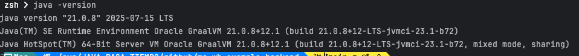
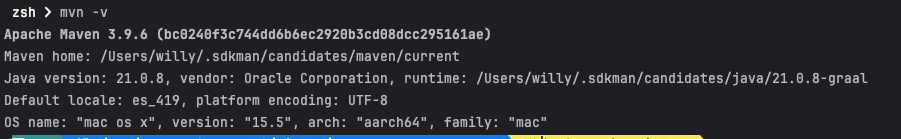
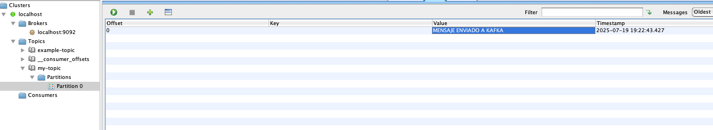
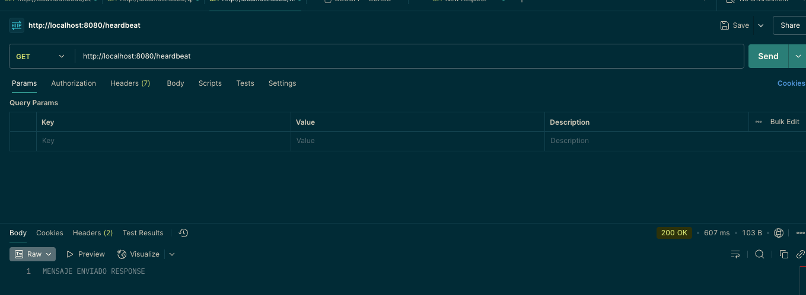
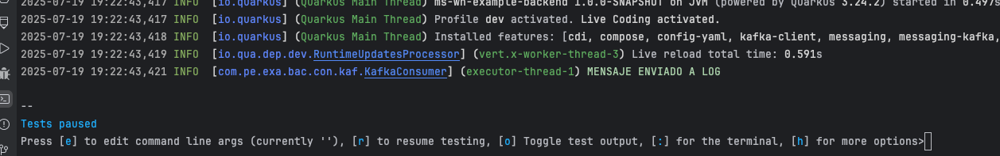

# ms-wh-example-backend

This project uses Quarkus, the Supersonic Subatomic Java Framework.

If you want to learn more about Quarkus, please visit its website: <https://quarkus.io/>.

## Running the application in dev mode

You can run your application in dev mode that enables live coding using:

```shell script
./mvnw quarkus:dev
```

> **_NOTE:_**  Quarkus now ships with a Dev UI, which is available in dev mode only at <http://localhost:8080/q/dev/>.

## Packaging and running the application

The application can be packaged using:

```shell script
./mvnw package
```

It produces the `quarkus-run.jar` file in the `target/quarkus-app/` directory.
Be aware that it’s not an _über-jar_ as the dependencies are copied into the `target/quarkus-app/lib/` directory.

The application is now runnable using `java -jar target/quarkus-app/quarkus-run.jar`.

If you want to build an _über-jar_, execute the following command:

```shell script
./mvnw package -Dquarkus.package.jar.type=uber-jar
```

The application, packaged as an _über-jar_, is now runnable using `java -jar target/*-runner.jar`.

## Creating a native executable

You can create a native executable using:

```shell script
./mvnw package -Dnative
```

Or, if you don't have GraalVM installed, you can run the native executable build in a container using:

```shell script
./mvnw package -Dnative -Dquarkus.native.container-build=true
```

You can then execute your native executable with: `./target/ms-whh-backend-cart-product-1.0.0-SNAPSHOT-runner`

If you want to learn more about building native executables, please consult <https://quarkus.io/guides/maven-tooling>.

## Related Guides

- RESTEasy Classic Mutiny ([guide](https://quarkus.io/guides/resteasy#reactive)): Mutiny support for RESTEasy Classic server
- REST Jackson ([guide](https://quarkus.io/guides/rest#json-serialisation)): Jackson serialization support for Quarkus REST. This extension is not compatible with the quarkus-resteasy extension, or any of the extensions that depend on it
- YAML Configuration ([guide](https://quarkus.io/guides/config-yaml)): Use YAML to configure your Quarkus application
- Quarkus Extension for Spring DI API ([guide](https://quarkus.io/guides/spring-di)): Define your dependency injection with Spring DI

## Provided Code

### YAML Config

Configure your application with YAML

[Related guide section...](https://quarkus.io/guides/config-reference#configuration-examples)

The Quarkus application configuration is located in `src/main/resources/application.yml`.

### REST

Easily start your REST Web Services

[Related guide section...](https://quarkus.io/guides/getting-started-reactive#reactive-jax-rs-resources)

### RESTEasy JAX-RS

Easily start your RESTful Web Services

[Related guide section...](https://quarkus.io/guides/getting-started#the-jax-rs-resources)


## CONFIGURACION DE PROYECTO

### ..:: VERSION DE JAVA ::..




### ..:: VERSION DE MVN ::..



### ..:: KAFKA ::..

```shell script
version: '3.8'

services:
  zookeeper:
    image: confluentinc/cp-zookeeper:7.5.0
    container_name: zookeeper
    ports:
      - "2181:2181"
    environment:
      ZOOKEEPER_CLIENT_PORT: 2181
      ZOOKEEPER_TICK_TIME: 2000

  kafka:
    image: confluentinc/cp-kafka:7.5.0
    container_name: kafka
    ports:
      - "9092:9092"
    environment:
      KAFKA_BROKER_ID: 1
      KAFKA_ZOOKEEPER_CONNECT: zookeeper:2181
      KAFKA_ADVERTISED_LISTENERS: PLAINTEXT://localhost:9092
      KAFKA_OFFSETS_TOPIC_REPLICATION_FACTOR: 1
    depends_on:
      - zookeeper
```


### ..:: JENKINS ::..
```shell script


```


## PRUEBAS

#### KAFKA


#### RESPONSE



#### LOG




## QUARKUS

#📌 Tabla de equivalencias de dependencias


| Funcionalidad        | Spring Boot Dependency               | Quarkus Extension                                | Comentario                                       |
| -------------------- | ------------------------------------ | ------------------------------------------------ | ------------------------------------------------ |
| Core Framework       | `spring-boot-starter`                | `quarkus-resteasy` / `quarkus-resteasy-reactive` | RESTEasy en Quarkus puede ser clásico o reactivo |
| REST API             | `spring-boot-starter-web`            | `quarkus-resteasy-reactive`                      | Quarkus es más liviano y rápido                  |
| JSON (Jackson)       | `spring-boot-starter-json`           | `quarkus-resteasy-reactive-jackson`              | Ambos usan Jackson por defecto                   |
| JPA / Hibernate      | `spring-boot-starter-data-jpa`       | `quarkus-hibernate-orm-panache`                  | Panache facilita los queries                     |
| Base de datos (JDBC) | `spring-boot-starter-jdbc`           | `quarkus-jdbc-postgresql` / `quarkus-jdbc-mysql` | Más rápido de iniciar en Quarkus                 |
| Seguridad            | `spring-boot-starter-security`       | `quarkus-security`, `quarkus-oidc`               | Spring tiene más features, Quarkus es más simple |
| Kafka                | `spring-kafka`                       | `quarkus-smallrye-reactive-messaging-kafka`      | Quarkus usa MicroProfile y Reactive Messaging    |
| Scheduling / Cron    | `spring-boot-starter` + `@Scheduled` | `quarkus-scheduler`                              | Muy similar en uso                               |
| Archivos `.yml`      | Nativo (`application.yml`)           | Requiere `quarkus-config-yaml`                   | Spring lo soporta nativamente                    |
| Testing              | `spring-boot-starter-test`           | `quarkus-junit5`, `rest-assured`                 | Spring tiene ecosistema más amplio               |
| Validaciones Bean    | `spring-boot-starter-validation`     | `quarkus-hibernate-validator`                    | Ambos usan Hibernate Validator                   |


📌 Ventajas y desventajas generales

| Aspecto                 | Spring Boot                                   | Quarkus                                                                       |
| ----------------------- | --------------------------------------------- | ----------------------------------------------------------------------------- |
| 🧠 Madurez y comunidad  | Muy grande, estable y con mucha documentación | Comunidad más nueva, pero creciendo rápido                                    |
| 🚀 Tiempo de arranque   | Más lento, especialmente en JVM               | Súper rápido, ideal para entornos cloud-native y serverless                   |
| 📦 Tamaño del JAR       | Mayor, más pesado                             | Muy liviano                                                                   |
| 🔁 Soporte Reactivo     | Soporte parcial con `WebFlux`                 | Soporte completo y optimizado para programación reactiva                      |
| 🔥 Live reload          | Necesita plugins o DevTools                   | Dev mode nativo con `mvn quarkus:dev`                                         |
| 🧩 Microservicios       | Compatible pero más pesado                    | Diseñado desde cero para cloud-native y contenedores                          |
| ☁️ Kubernetes / GraalVM | Soporte con configuraciones adicionales       | Soporte nativo (incluye integración con Kubernetes, GraalVM, OpenShift, etc.) |

🧪 ¿Cuál deberías elegir?

| Si necesitas...                                    | Entonces... |
| -------------------------------------------------- | ----------- |
| Ecosistema maduro, integraciones enterprise        | Spring Boot |
| Tiempo de arranque rápido, eficiencia en memoria   | Quarkus     |
| Desarrollo tradicional monolítico                  | Spring Boot |
| Microservicios modernos en contenedores/Kubernetes | Quarkus     |
| Desplegar en serverless (AWS Lambda, etc.)         | Quarkus     |


📌 Algunas otras equivalencias útiles que puedes necesitar:

| Funcionalidad                        | Spring Boot                                      | Quarkus                                                   |
| ------------------------------------ | ------------------------------------------------ | --------------------------------------------------------- |
| Actuadores/monitoring                | `spring-boot-starter-actuator`                   | `quarkus-smallrye-health`, `quarkus-micrometer`           |
| Métricas                             | Micrometer integrado                             | `quarkus-micrometer`, `quarkus-smallrye-metrics`          |
| Tracing / Observabilidad             | `spring-cloud-sleuth`, `zipkin`, `opentelemetry` | `quarkus-opentelemetry`, `quarkus-jaeger`                 |
| API Gateway                          | Spring Cloud Gateway                             | No tiene propio; se recomienda usar Istio, Kong, etc.     |
| Server-Sent Events (SSE)             | WebFlux                                          | `quarkus-vertx-web`, `quarkus-resteasy-reactive`          |
| WebSockets                           | `spring-boot-starter-websocket`                  | `quarkus-websockets`                                      |
| OAuth2 / JWT                         | `spring-security-oauth2`, `spring-security-jwt`  | `quarkus-oidc`, `quarkus-smallrye-jwt`                    |
| Encriptación y Hashing               | BCrypt / Jasypt                                  | `quarkus-security`, librerías externas                    |
| Configuración remota (Config Server) | `spring-cloud-config`                            | `quarkus-kubernetes-config`, `quarkus-config-yaml`, Vault |
| Cloud (AWS/GCP/Azure)                | Spring Cloud AWS / GCP / Azure                   | `quarkus-amazon-lambda`, `quarkus-google-cloud-functions` |


# CI/CD con Jenkins, Docker hub, kubernetes


## ⚙️ 1. Instalación y configuración de Jenkin

### Instalación con Docker

```shell script
docker run -d --name jenkins \
-u root \
-p 8080:8080 -p 50000:50000 \
-v jenkins_home:/var/jenkins_home \
-v /var/run/docker.sock:/var/run/docker.sock \
jenkins/jenkins:lts
```
Esto levanta Jenkins en http://localhost:8080. proceder con la configuracion inicial.

## ⚙️ 2. Plugins necesarios en Jenkins

Ir a Manage Jenkins → Plugins → Available plugins e instalar:

-  ✅ Pipeline (soporte para Jenkinsfile).
-  ✅ Docker Pipeline (build & push imágenes Docker).
-  ✅ Kubernetes CLI (ejecutar kubectl).
-  ✅ Git (clonar repositorios).
-  ✅ Credentials Binding Plugin (manejo de credenciales).
-  ✅ Blue Ocean (opcional, interfaz gráfica de pipelines).


## ⚙️ 3. Configuración de credenciales en Jenkins


En Manage Jenkins → Credentials → (Global):

1.  🔑 dockerhub-cred
    - Tipo: Username with password.
    - Contiene usuario + token/password de Docker Hub.

2. 📄 kubeconfig-cred
   - Tipo: Secret file.
   - Contiene tu archivo ~/.kube/config (exportado de DigitalOcean).


## ⚙️ 4. Jenkinsfile (pipeline)
- Revisar la ruta deploy/jenkinsfile


